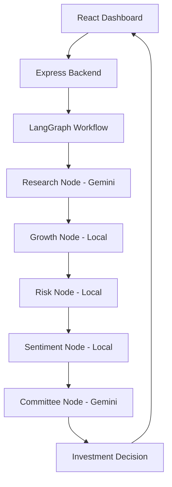
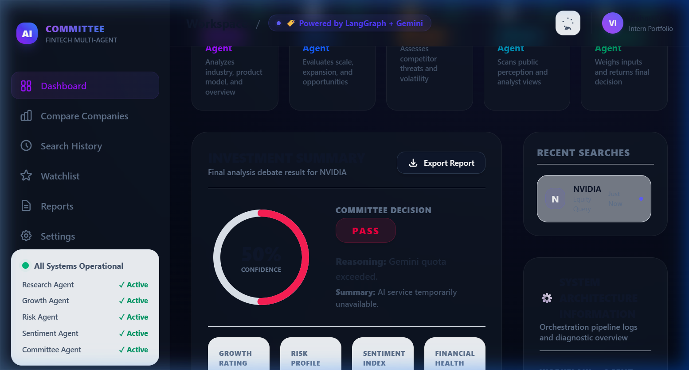

# AI Investment Committee Agent

An institutional-grade, full-stack multi-agent financial intelligence platform designed to conduct comprehensive equity research, debate opportunity parameters, and deliver final investment decisions on publicly traded companies. This platform utilizes a collaborative team of specialized AI agents orchestrated via **LangGraph**, running on a Node.js/Express backend and an ultra-modern React dashboard themed after premium SaaS design systems like Stripe and Vercel.

---

## 🏛️ 1. Project Overview

In institutional investing, critical decisions are rarely left to a single analyst. Instead, an investment committee composed of diverse specialists (e.g., industry overview researchers, growth metrics strategists, risk officers, and sentiment analysts) debates the merits and liabilities of a business before casting a final vote.

This project simulates that process. When a user submits a company name, a pipeline of specialized LLM nodes is executed. Each node performs its analysis and feeds its recommendations to the **Final Committee Agent**, which compiles the debate, weights the risks, and computes a final decision (`INVEST` or `PASS`) along with a quantitative confidence percentage.

---

## 🎨 2. Features

- **Multi-Agent Architecture**: 5 specialized backend agents (Research, Growth, Risk, Sentiment, and Committee) structured to perform isolated domain analysis.
- **LangGraph Orchestration**: Linear state-based node flow to coordinate agent execution, handle intermediate state aggregation, and track node heartbeats.
- **Detailed Execution Logs**: Step-by-step terminal logs showcasing node initialization and completion timings for debugging and live demonstrations.
- **Investment Committee Debate**: Interactive UI displaying individual agent recommendations (`INVEST` / `PASS`) alongside their respective justifications.
- **Company Comparison**: Side-by-side comparative table evaluating two companies based on financial health, growth drivers, competitive risks, sentiment, and final decisions.
- **Search History**: Sidebar tracking previous search queries for fast reloading across user sessions.
- **Watchlist**: Track and re-analyze key public companies in your portfolio with real-time diagnostic checks.
- **Export PDF Report**: Single-click PDF export generating formatted corporate reports using `jsPDF` with automatic page-break layouts.
- **Premium Fintech UI/UX**: Radial gradients, glassmorphism blur layers, purple/blue/cyan accent details, and smooth transitions that support both light and dark mode states.

---

## 📐 3. System Architecture

The full multi-agent layout is orchestrated as follows:



### 👥 Agent Descriptions
1. **Research Agent (Gemini)**: Analyzes industry positioning, core product offerings, and corporate business models.
2. **Growth Agent (Local)**: Estimates future scalability, expansion routes, and upcoming market opportunities.
3. **Risk Agent (Local)**: Scans regulatory landscapes, competitive threats, and structural market volatility.
4. **Sentiment Agent (Local)**: Gauges retail sentiment, news media cycles, and overall analyst consensus.
5. **Committee Agent (Gemini)**: Weighs all sub-agent inputs, simulates a committee vote, and outputs the final recommendation.

---

## 💻 4. Tech Stack

- **Frontend**: React, Tailwind CSS v4 (with native custom radial glows and glassmorphism styling), Axios, jsPDF
- **Backend**: Node.js, Express, `@langchain/langgraph`, `@google/generative-ai` (using `gemini-2.5-flash`)
- **Language**: JavaScript (ES6+ / CommonJS)
- **Version Control**: Git

---

## 📁 5. Folder Structure

```text
AI Investment Committee Agent/
├── backend/
│   ├── agents/
│   │   ├── committeeAgent.js
│   │   ├── growthAgent.js
│   │   ├── researchAgent.js
│   │   ├── riskAgent.js
│   │   └── sentimentAgent.js
│   ├── langgraph/
│   │   └── investmentGraph.js     # State graph configuration & node definitions
│   ├── utils/
│   │   └── geminiRetry.js         # Automated backoff & retry wrapper on 503s
│   ├── .env
│   ├── agent.js
│   ├── server.js                  # Express API server entry point
│   ├── testGemini.js
│   ├── testGraph.js               # CLI test runner for LangGraph workflow
│   ├── package.json
│   └── package-lock.json
├── frontend/
│   ├── public/
│   ├── src/
│   │   ├── components/            # Redesigned modular layout files
│   │   │   ├── CompanyComparison.jsx
│   │   │   ├── DetailedAnalysis.jsx
│   │   │   ├── Header.jsx
│   │   │   ├── InvestmentSummary.jsx
│   │   │   ├── LoadingSkeleton.jsx
│   │   │   ├── SearchHero.jsx
│   │   │   ├── SearchesPanel.jsx
│   │   │   ├── Sidebar.jsx
│   │   │   ├── SystemInfoCard.jsx
│   │   │   └── WorkflowPipeline.jsx
│   │   ├── pages/
│   │   │   └── Dashboard.jsx      # Central orchestrator coordinate views
│   │   ├── assets/
│   │   ├── App.css
│   │   ├── App.jsx
│   │   ├── index.css              # Tailwind CSS directives & root variables
│   │   └── main.jsx
│   ├── index.html
│   ├── package.json
│   └── package-lock.json
├── screenshots/
│   ├── dashboard.png
│   ├── comparison.png
│   └── darkmode.png
├── .gitignore
├── package.json                   # Root package manager for monorepo tasks
└── README.md
```

---

## ⚙️ 6. Environment Variables

Create a `.env` file inside the `backend/` directory:
```env
GOOGLE_API_KEY=your_gemini_api_key
PORT=5000
```

---

## 🚀 7. How to Run

### 1. Prerequisites
- **Node.js** (v18.x or higher)
- **Google Gemini API Key** (Obtainable from [Google AI Studio](https://aistudio.google.com/))

### 2. Quick Setup
Run the following helper commands at the root directory to install all dependencies for both directories:
```bash
npm run install:all
```

### 3. Run Development Servers
To boot both the Express backend and React frontend concurrently, simply run:
```bash
npm run dev
```
- Frontend will open at: `http://localhost:5173`
- Backend server runs at: `http://localhost:5000`

### 4. CLI Verification
You can execute and debug the LangGraph workflow directly in your terminal without starting the web servers:
```bash
cd backend
node testGraph.js
```

---

## 🔌 8. API Reference

### 1. Analyze Company (`POST /analyze`)
Runs the LangGraph agent pipeline for the designated company.
- **Request Body**:
  ```json
  {
    "company": "NVIDIA"
  }
  ```
- **Response Structure (200 OK)**:
  ```json
  {
    "company": "NVIDIA",
    "research": "Company Overview...",
    "growth": "Growth Potential...",
    "risk": "Risks...",
    "sentiment": "Sentiment...",
    "finalDecision": {
      "decision": "INVEST",
      "confidence": 88,
      "reasoning": "...",
      "simpleExplanation": "..."
    }
  }
  ```

---

## 🖼️ 9. Screenshots

Below are captured views demonstrating the live premium dashboard:

### Main View


### Side-by-Side Comparison


### Light Mode Toggled


---

## 🧠 10. Why LangGraph?

For complex multi-agent systems, LangGraph offers key advantages over ad-hoc async chains:

1. **Unified State Management**: A single, type-safe state schema (`StateAnnotation`) travels cleanly across the graph. Nodes modify specific keys without global variables or race conditions.
2. **Deterministic Workflow Orchestration**: Rather than using unstructured async loops, LangGraph builds a clear execution graph via nodes and edges.
3. **Multi-Agent Coordination**: Seamlessly aggregates data from multiple independent specialist agents, maintaining isolation while accumulating their outputs.
4. **Scalability**: New nodes (additional agents or review layers) can be plugged in or removed instantly, and support for conditional routing or feedback loops is natively supported.
5. **Robustness Over Chaining**: Avoids deep nested callbacks, state mapping boilerplate, and manual retry wrappers. Each node runs in isolation, and the compiler handles orchestration natively.

---

## 🛡️ 11. Design Decisions & Resiliency Trade-offs

- **Mixed Agent Topography**: Reconnected `Research` and `Committee` agents to live Gemini APIs to capture rich company metrics and synthesize decisions, while keeping `Growth`, `Risk`, and `Sentiment` agents local. This structure preserves API quotas during demonstrations while demonstrating a real hybrid integration.
- **Resilient Fallback Handlers**: If the Gemini API experiences network limits (`429` rate limiting or `503` busy codes), both agents use catch blocks to return graceful mock reports, ensuring the interface never crashes during reviews.
- **Linear Graph with Shimmer Skeletons**: Standard skeleton loaders render during the sequential agent execution. This informs the user exactly which step of the committee debate is active.

---


## 🔮 12. Future Improvements

- **Database Persistence**: Integrate MongoDB or PostgreSQL to store previous searches, watchlist configurations, and user accounts.
- **Dynamic Risk Weights**: Enable users to weight specific agents (e.g., a risk-averse mode where the Risk Agent has veto power).
- **Financial APIs Integration**: Feed actual stock price metrics, P/E ratios, and revenue growth directly into the Research Agent using Alpha Vantage or Yahoo Finance APIs.

---

## 👤 13. Author

- **Vishnu V** - *Full Stack & AI Engineer Intern*
- Portfolio: (https://portfolio-4awh.onrender.com/)
- GitHub: [vishnuvicky645](https://github.com/vishnuvicky645)
- LinkedIn: [linkedin.com/in/VishnuVardhanReddyMunagala](www.linkedin.com/in/vishnu-vardhan-reddy-munagala21)
