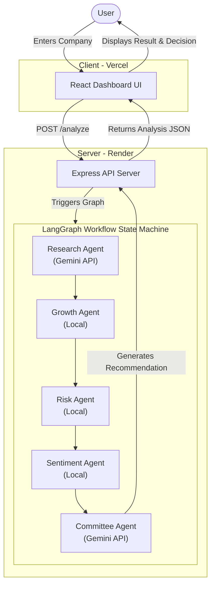
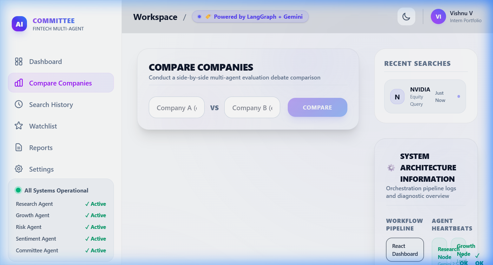
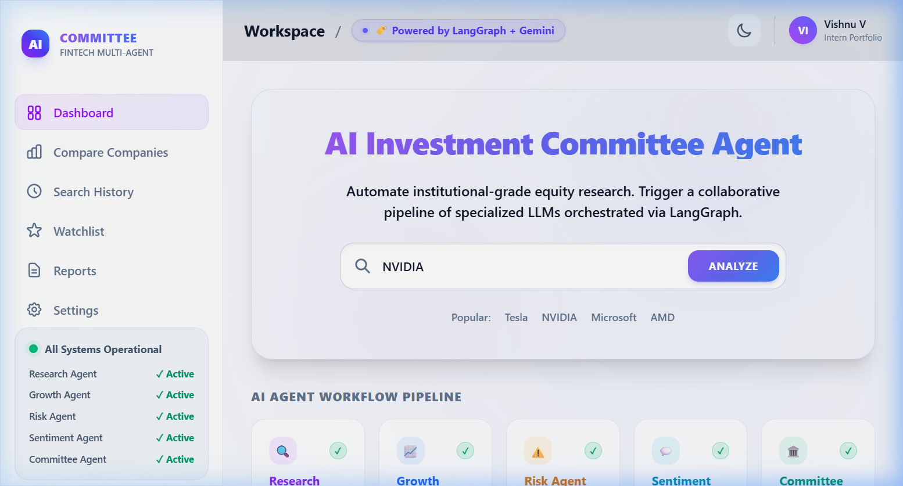
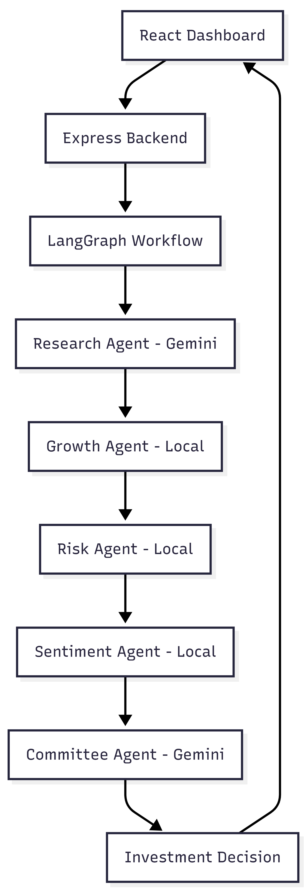

# 🏛️ AI Investment Committee Agent

A multi-agent AI-powered investment research platform built using React, Express, LangGraph, and Gemini.

  
  
  
  
  
  
  

---

## 🚀 Features

* **Multi-Agent Investment Research System**: Utilizes specialized LLM nodes working collaboratively to analyze various company parameters (Research, Growth, Risk, Sentiment).
* **LangGraph State Machine Orchestration**: Handles complex workflows, structured state transitions, and node coordinates cleanly without nested callback chains.
* **Gemini API Integration**: Leverages Google's state-of-the-art `gemini-2.5-flash` model for rich financial analysis and structured decision synthesis.
* **Company Comparison Dashboard**: Side-by-side comparative views evaluating two companies' strengths, risks, growth vectors, and final ratings.
* **Search History**: A persistent sidebar tracking previous company analyses for swift reloading across sessions.
* **Confidence Meter**: Visualizes the quantitative confidence level of the final investment recommendation.
* **Dark Mode**: Supports modern dark and light mode themes built using CSS custom variables and premium radial glows.
* **Fallback Mode for API Quota Failures**: Elegant fallback error-handlers to ensure the dashboard continues functioning gracefully using local mocked components if API limits are hit.
* **Responsive FinTech Dashboard**: A fully adaptive user interface tailored after professional SaaS design systems like Vercel and Stripe.
* **Production Deployment**: Configured and optimized for hosting on high-performance cloud environments.

---

## 🛠️ Tech Stack

### Frontend
* **Framework**: React (Vite)
* **HTTP Client**: Axios
* **Styling**: Vanilla CSS (Tailwind variables, custom glassmorphism effects, radial gradients)
* **Utilities**: jsPDF (for structured corporate PDF exports)

### Backend
* **Runtime**: Node.js
* **Framework**: Express.js
* **Orchestration**: `@langchain/langgraph` & LangChain Community packages

### AI & Orchestration
* **LLM Engine**: Google Gemini API (`gemini-2.5-flash`)
* **Orchestration framework**: LangGraph Node Workflows

### Deployment
* **Frontend Hosting**: Vercel
* **Backend Hosting**: Render

---

## 🌐 Live Demo

🔗 **Frontend (Vercel)**: [https://langgraph-investment-committee-agen.vercel.app/](https://langgraph-investment-committee-agen.vercel.app/)

🔗 **Backend (Render)**: [https://langgraph-investment-committee-agent.onrender.com](https://langgraph-investment-committee-agent.onrender.com)

---

## 📐 Architecture

Below is the conceptual flow of how the multi-agent system processes requests:

---

## 🖼️ Screenshots

### Dashboard

### Company Comparison

### Dark Mode

### Architecture Diagram

### Deployment Screenshot
*(Note: Refer to Vercel/Render Live links above for the fully deployed application status)*

---

## ☁️ Deployment Note

> [!IMPORTANT]
> The backend server is hosted on Render's **Free Tier**. As a result, the server will go to sleep after periods of inactivity. If you are accessing the demo for the first time in a while, please allow **30–60 seconds** for the backend instance to spin up.

---

## 🔮 Future Improvements

* **Real-time stock APIs**: Integration with live equity data providers (e.g. Yahoo Finance, Alpha Vantage) for actual ticker prices and real-time updates.
* **Authentication System**: Secure user registration and login portals using JWT or Firebase Auth to manage personal portfolios.
* **Portfolio Tracking**: Real-time asset tracker visualizing gain/loss charts and transaction history.
* **Watchlist**: Advanced watchlist metrics with dynamic triggers and alert configurations.
* **Email Reports**: Daily or weekly automated investment report delivery to registered emails.
* **Historical Stock Analytics**: Interactive charts showcasing historical performance metrics using Chart.js or Recharts.

---

## ✍️ Author

**Vishnu V**

* 🎓 BTech CSE (AI & ML) — **Lovely Professional University**
* 🐙 GitHub: [@vishnuvicky645](https://github.com/vishnuvicky645)
* 💼 LinkedIn: [linkedin.com/in/VishnuVardhanReddyMunagala](https://www.linkedin.com/in/vishnu-vardhan-reddy-munagala21)
